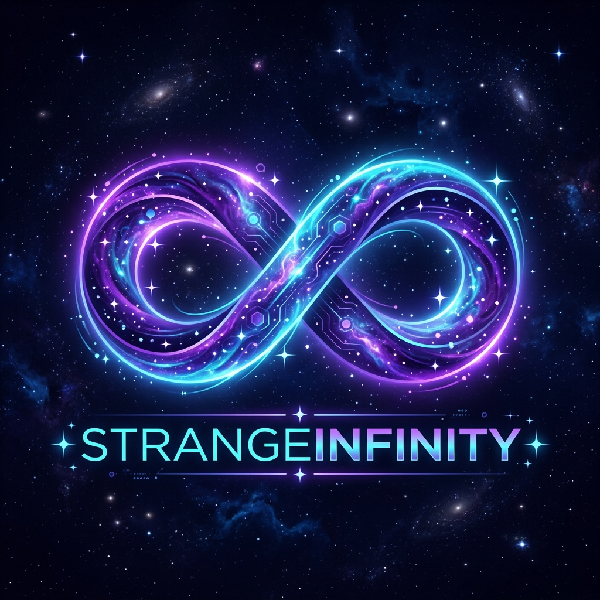

<div align="center">

  

  # StrangeInfinity
  
  **Open-Source Software, Desktop Applications & Digital Innovations**

  [](https://strangeinfinity.github.io/)
  [](https://github.com/strangeinfinity/)
  [](https://opensource.org/licenses/MIT)

  <p align="center">
    <i>Crafting software that pushes beyond the ordinary — open-source tools, desktop apps, and boundary-breaking digital experiments from the edge of the cosmos.</i>
  </p>

  ---

  [**Explore the Website**](https://strangeinfinity.github.io/) • [**Featured Products**](#-featured-products) • [**Core Mission**](#-mission--purpose) • [**Ecosystem**](#-project-ecosystem) • [**Connect**](#-connect--community)

</div>

<br />

## 🌌 About StrangeInfinity

**[StrangeInfinity](https://strangeinfinity.github.io/)** is the official digital portal and showcase hub for the StrangeInfinity open-source ecosystem. It serves as a central platform presenting a diverse portfolio of desktop software, productivity applications, computer vision tools, and experimental utilities built with passion for the global developer community.

The website exists to bridge the gap between creative code experiments and everyday digital utilities, giving users and developers an intuitive window into all active projects, documentation, and live demonstrations.

---

## 🎯 Mission & Purpose

At StrangeInfinity, the philosophy is simple: **build software that matters, keep it open, and prioritize user empowerment.**

* **🌐 Open-Source by Default**: Everything is built transparently in public, fostering community learning, contribution, and libre software.
* **🛡️ Privacy & Independence**: Prioritizing local-first processing, zero-telemetry architectures, and software that respects user sovereignty.
* **⚡ Speed & Practical Utility**: Lightweight, bloat-free solutions designed to solve real problems smoothly and reliably.
* **🔬 Curious Exploration**: Experimenting across desktop GUI applications, computer vision, AI terminal assistants, and modern web environments.

---

## 🚀 Featured Products

The StrangeInfinity portal highlights several flagship software products and open-source applications:

<table>
  <tr>
    <td width="50%" valign="top">
      <h3>🌐 Infinity Browser</h3>
      <p>A fast, privacy-focused desktop web browser built with Python and Qt. Designed to provide a streamlined, distraction-free browsing experience with built-in ad blocking, local password security, and custom script support.</p>
      <ul>
        <li>🛡️ Built-in tracking and ad protection</li>
        <li>📁 Integrated download manager & PDF reader</li>
        <li>🔒 Local secure credential vault</li>
      </ul>
      <p><a href="https://strangeinfinity.github.io/Infinity-Browser/"><strong>Visit Browser Portal »</strong></a></p>
    </td>
    <td width="50%" valign="top">
      <h3>✍️ Infinity Writer</h3>
      <p>A specialized, distraction-free writing and markup tool built to generate pristine, semantic, and production-ready HTML code with out-of-the-box native dark mode styling.</p>
      <ul>
        <li>📄 Clean, standards-compliant HTML output</li>
        <li>🌓 Seamless dark & light mode styling</li>
        <li>⚡ Zero external runtime dependencies</li>
      </ul>
      <p><a href="https://strangeinfinity.github.io/Infinity-Writer/"><strong>Visit Writer Portal »</strong></a> • <a href="https://github.com/dev-hints/Infinity-Writer">GitHub</a></p>
    </td>
  </tr>
  <tr>
    <td width="50%" valign="top">
      <h3>🖐️ AirPointer</h3>
      <p>A touchless virtual mouse system that translates natural hand gestures captured via webcam into real-time cursor navigation and click actions using computer vision.</p>
      <ul>
        <li>👁️ Real-time hand landmark tracking</li>
        <li>🖱️ Gesture-based pointer & click controls</li>
        <li>⚡ Lightweight, low-latency execution</li>
      </ul>
      <p><a href="https://github.com/dev-hints/AirPointer"><strong>Explore Repository »</strong></a></p>
    </td>
    <td width="50%" valign="top">
      <h3>📝 Cosmic Notes</h3>
      <p>A responsive, visually engaging note-taking suite designed with a cosmic glassmorphism aesthetic, rich-text editing, instant category filtering, and offline local persistence.</p>
      <ul>
        <li>🌌 Deep space glassmorphic interface</li>
        <li>🏷️ Dynamic tag indexing & instant search</li>
        <li>💾 Local offline auto-save storage</li>
      </ul>
      <p><a href="https://github.com/dev-hints/Notes-App"><strong>Explore Repository »</strong></a></p>
    </td>
  </tr>
</table>

---

## 🧭 Project Ecosystem & Categories

The StrangeInfinity hub categorizes and tracks various tools across different technology domains:

* **Desktop Applications**: Native multi-platform software crafted with Python & PyQt6 (including *Infinity Browser* and *2048 Nexus*).
* **AI & Computer Vision**: Interactive vision systems and terminal interfaces (such as *AirPointer* and *Gemini CLI*).
* **Web Utilities & Productivity**: Modern, accessible browser tools designed for fast everyday workflows (*Infinity Writer*, *Notes App*, *To-Do Manager*).
* **Interactive & Scientific Tools**: Math engines, logic challenges, and games (*CalcCosmos*, *2048 Nexus*, *Neon Snake*).

---

## 💎 Core Values

```
           ┌───────────────────────────────────────────────┐
           │            STRANGEINFINITY VALUES             │
           └───────────────────────────────────────────────┘
                                   │
         ┌─────────────────┬───────┴────────┬─────────────────┐
         ▼                 ▼                ▼                 ▼
   [ Open Source ]  [ Privacy First ]  [ Performance ]  [ Innovation ]
   Accessible code   Zero telemetry,   Zero bloat &      Pushing tech
   built in public   local control     lightning fast    frontiers
```

1. **Open Collaboration**: Sharing knowledge openly with developer communities worldwide.
2. **User Privacy**: Respecting user autonomy with local-first architectures.
3. **Craftsmanship**: Attention to typography, visual balance, and ergonomic UX.
4. **Continuous Learning**: Exploring the bleeding edge of AI, interfaces, and algorithms.

---

## 🌐 Explore the Live Site

Visit the live website to browse interactive project cards, test live demos, and check out product documentation:

👉 **[strangeinfinity.github.io](https://strangeinfinity.github.io/)**

---

## 🤝 Connect & Community

Feedback, collaboration, and ideas are always welcome. Connect with StrangeInfinity across the web:

* 🌐 **Website**: [strangeinfinity.github.io](https://strangeinfinity.github.io/)
* 🐙 **GitHub**: [@strangeinfinity](https://github.com/strangeinfinity/)
* 𝕏 **Twitter / X**: [@strang3infinity](https://x.com/strang3infinity)
* 📸 **Instagram**: [@strangeinfinity.dev](https://instagram.com/strangeinfinity.dev)
* 💼 **LinkedIn**: [Ayush Kumar Maurya](https://in.linkedin.com/in/ayush-kumar-maurya/)
* ✉️ **Email**: [strangeinfinity.dev@gmail.com](mailto:strangeinfinity.dev@gmail.com)

---

<div align="center">
  <sub>Built with care &amp; cosmic curiosity. © StrangeInfinity. Open-source under the MIT License.</sub>
</div>
